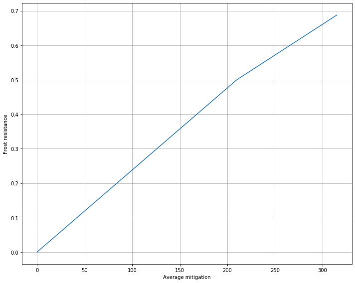

```python
import pandas as pd
import matplotlib.pyplot as plt
```

## Frost resistance analsis

There has been a lot of false information on our Undecided discord about how resistances in classic actually work. Some pieces of provided information are misleading, from privat server days, from "feeling" and others are just wrong. The most elaborate testing was done by a warlock. This is the most reliable information we have:
https://royalgiraffe.github.io/resist-guide

For "non-binary" spells like the frost aura of Saphiron one of the following events can happen: <br />
<ul>
    <li>0% resist</li>
    <li>25% resist</li>
    <li>50% resist</li>
    <li>75% resist</li>
    <li>Spell misses completely (in warcraftlogs shown as resist)</li>
</ul>
The miss chance is always flat 1%, but the probabilities of the partial resists change with your frost resistance gear.

The average (average is important, because the mitigation is in fact a random variable) mitigation, depending on your frost resistance, can be written as follows:


where r is your corrent resistance.


```python
def mitigation(r):
    return 0.75*(r/315)-(3/16)*max(0, (r/315)-2/3)
```

Lets do a plot of the average mitigation to get a better feeling for the qualitative behavior of the function.


```python
resistances = [i for i in range(316)]
mitigation_values = [mitigation(r) for r in resistances]
```


```python
# plot the graph
fig, ax = plt.subplots(figsize=(10, 8))
ax.plot(resistances, mitigation_values)
ax.set_ylabel('Frost resistance')
ax.set_xlabel('Average mitigation')
ax.grid(True)
fig.tight_layout()
```





As you can see in the formula, and also the graph, the average mitigation increases linearly (therefore every point of frost resistance matters. There are no "hard" caps except 315) with frost resistance up to 210 frost resistance and 50% mitigation. 
However, even though you still have a linear increase in average mitigation with more frost resistance, the slope of the line is less. Keep also in mind that the supreme master class rogues and those damn browns have Frost Juju and a shaman totem, automatically yielding 75 frost resistance. 

So how much value is one point of frost resistance? If floating point resistance values were a thing, we would calculate the derivative. But since we are only interested in the difference of mitigation if we increase frost resistance by one, we can just calculate the desired quantity as follows: 


```python
delta_m1 = mitigation(100)-mitigation(99)
```


```python
delta_m2 = mitigation(300)-mitigation(299)
```


```python
delta_m1
```


    0.0023809523809523725


```python
delta_m2
```


    0.0017857142857142794


Frost resistance under 210 adds around 0.24% additional resistance, while above 210 only additional 0.18% additional resistance.

### But how does this translate to incoming damage on saphiron?

Saphiron's frost aura does 600 damage every two seconds. This equals 300dps. 
Our last fight took 240s (4min). Over such a fight one point of additional frost resistance lowers the damage taken by

171 damage below 210 total frost resistance and 129 damage above 210 total frost resistance. 


```python
delta_m1 * 240 * 300
```


    171.42857142857082


```python
delta_m2 * 240 * 300
```


    128.5714285714281


## Conclusion

The analysis clearly shows that frost resistance above 210 (which equals 135 unbuffed) still lowers the damage taken, but loses value.
You might argue that increasing frost resistance unconditionally is still the way to go. You need to, however, also consider other variables (doing one dimensional analysis is rarely a good idea).
We clearly showed that frost resistance above a certain point loses value. This also comes hand in hand with the fact that every point of frost resistance is traded for dps.<br />
As a rogue you can reach around 205 frost resistance with the craftable epic pieces and the enchant on your legs. If you want to have more, you would either need to have one of the epic frost resistance pieces that drop in naxx (which not everyone has) or you need to make an inefficient trade with the blue trinket/blue or green frost resistance pieces which are a horrible trade. By this point frost resistance has already lost value and making a horrible trade just to push a bit more frost resistance does more harm than help in my opinion. <br />
Furthermore, you have to also consider air phases on saphiron. There are dps barriers that make you skip air phases, which does not only reduce the strain on the healers, but also reduces the probability of many people dying to breaths (i.e. when all frost blocks are on one side). <br />
Lastly I want to mention that the supreme master class rogue is already taking the least amount of damage on saphiron. Therefore my advice is that the rogues keep the frost resistance values they are currently using unless they can increase it by an efficient trade. Oh and for all the browns reading this, remember that the master class is rogue.
